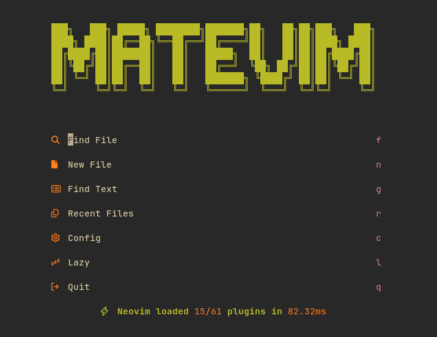

[](LICENSE)

> Neovim personal config based on [LazyVim](https://github.com/LazyVim/LazyVim).

Designed for full-stack development with PHP, Vue.js, Go and SQL.

## Índice

- [Background](#background)
- [Requirements](#requirements)
- [Instalation](#instalation)
- [Usage](#usage)
- [Contributing](#contributing)
- [Licence](#licence)

## Background

MateVim is a modular config where each file in `lua/plugins/` returns a lazy.nvim spec, and `lua/plugins/lang/` extends shared `opts` tables per language (LSP, formatters, linters, DAP). Highlights:



- **LSP** via `mason` + `nvim-lspconfig` (PHP, TS/JS/Vue, CSS, Lua, Go, SQL).
- **Completion** with [blink.cmp](https://github.com/Saghen/blink.cmp) + LuaSnip.
- **Format on-save** with `conform.nvim` and **linting** with `nvim-lint`.
- **Debug** with `nvim-dap` and **tests** with `neotest`.
- **Database UI** (`vim-dadbod-ui`) and **HTTP client** (`kulala.nvim`).
- **UI** with `snacks.nvim`, `noice`, `bufferline`, `lualine`, and `which-key`.
- **Colorscheme**: `gruvbox`

## Requirements

- Neovim 0.10+
- Git
- A [NerfFont](https://www.nerdfonts.com/) (needed to display some icons)
- **tree-sitter-cli** and a **C** complier (`gcc/clang`)
- [lazygit](https://github.com/jesseduffield/lazygit)
- [ripgrep](https://github.com/BurntSushi/ripgrep) and [fd](https://github.com/sharkdp/fd) for searching
- a terminal that support true color, I recommend [ghostty](https://ghostty.org/) for this

## Instalation

Make a backup of your existing configs

```sh
mv ~/.config/nvim ~/.config/nvim.bak 2>/dev/null
```

Clone the repo, but I strongly recommend that you fork it.

```sh
git clone https://github.com/SttavoS/MateVim ~/.config/nvim
```

Remove the `.git` folder, not necessary if you make the fork.

```sh
rm -rf ~/.config/nvim/.git
```

Run neovim for the first time to download dependencies.

```sh
nvim
```

You can run `:checkhealth` to verify that everything is working.

## Usage

- Use `VimBeGood` to learn the vim motions.
- Complete keybind reference in [`docs/keybinds.md`](docs/keybinds.md).

## Contributing

Personal configs, but PRs are appreciated.

## License

[MIT](LICENSE) © Gustavo Schneider
